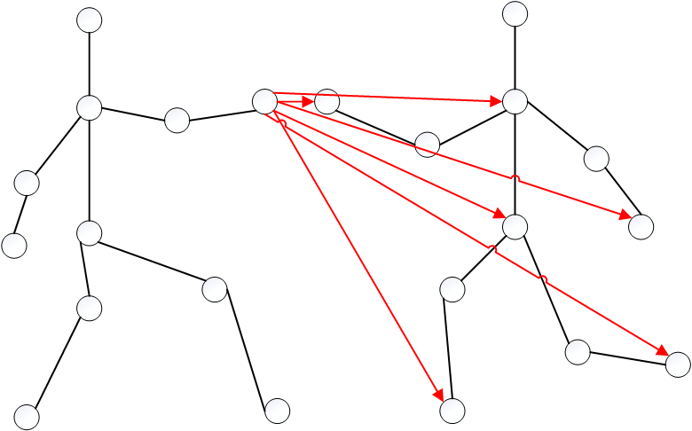

# UVAGCN

​	我们参加了基于人工智能校园算法大赛——骨骼动作识别赛道[【算法挑战赛】基于无人机的人体行为识别-排行榜-赛氪](http://bdc.saikr.com/c/rl/50186?t=2)	

​	以下是我们使用的具体模型和方法

## 方法介绍

​	我们总体上使用了多模态+多模型的方法。

​	另外，我们使用了一种具有创新性的GCN建图方法，在每个模型上面都能得到很大的提升。

​	通过对数据的观察，我们发现有10%左右的数据的类别是关系到两个人关联的动作的，比如 `A082: rob something from someone` , `hug` 等，而且我们观察到数据集中几乎有99%的数据都存在两个人的骨架数据，但是我们考察的大部分模型在处理此类数据时都是将两个人拆解成两个独立的个体，GCN也是只关系到一个人的17个关节的 `17*17` 的邻接矩阵，因此我们设计了一种 关系到两个人的 `34*34` 的邻接矩阵。具体的连接方式和说明见论文。



​	

​	在此次比赛中使用的CTRGCN、TEGCN 、DeGCN作为我们的基础模型，采用了Joint、bone、joint_motion 和 bone_motion以及新连接方式的joint_two五种数据形式，对每个模型的不同模态做后融合得到我们的最终答案。

| 模型   | testA | testB  |
| ------ | ----- | ------ |
| CTRGCN | 49.15 | 47.783 |
| TEGCN  | 48.15 | 46.343 |
| DeGCN  | 51.75 | /      |

# 环境依赖

+ python 3.10
+ pytorch==1.13.0， torchaudio==0.13.0， torchvision == 0.14.0

```
# process
conda create -n uvagcn python=3.10
cd uvagcn
pip install -r requirements.txt
cd torchlight
pip install -e .
cd ../torchpack
pip install -e .
cd ../apex
pip install -v --disable-pip-version-check --no-build-isolation --no-cache-dir ./
```

# 数据集

训练和测试数据统一放在 [.\resources\data](.\resources\data)

文件结构如下 （如果要生成`testB`的不同模态的数据，请对`resources`中的`gen_model.py` 中的生成路径进行修改，以对应文件结构）

```
└─data
    ├── test_bone.npy
    ├── test_bone_motion.npy
    ├── test_joint.npy
    ├── test_joint_motion.npy
	├── train_bone.npy
	├── train_bone_motion.npy
	├── train_joint.npy
    ├── train_joint_motion.npy
    ├── train_label.npy
    ├── val_bone.npy
    ├── val_bone_motion.npy
    ├── val_joint.npy
    ├── val_joint_motion.npy
    └── val_label.npy
```

# 模型运行

​	具体模型运行的方法在每个子目录下:

+ [CTRGCN](./MS-CTR-GCN)        

+ [TEGCN](.\TE-GCN)

+ [DeGCN](.\DeGCN_pytorch)

+ [SkateFormer](SkateFormer)

  模型训练过程中的log文件也在Google Drive上

# 模型集成

```
cd MS-CTR-GCN
sh ensemble_model.sh  # 选择1
```

```
cd DeGCN_pytorch
sh ensemble_all.sh # 选择2 效果好点
```

